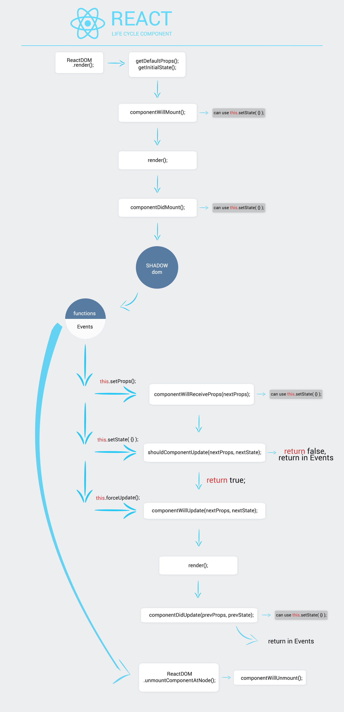

# Жизненный цикл компонентов в reactjs

> В этом гайде мы будем использовать синтаксис ES6+
> по этому вам уже нужно уметь настроить Webpack + babel

Каждый компонент имеет свой жизненный цикл, когда он только обработался библиотекой, когда он готов для добавления в DOM или когда состояние компонента было изменено. Из прошлого урока мы поняли, что основной метод библиотеки это метод `render()`. Все методы ЖЦ в реакте являются вспомогательными для того, чтобы перехватить данные и обработать их. Даже метод `render()` является лишь частью ЖЦ.



Это полный жизненный цикл компонента react. Самым началом является `ReactDOM.render();`, ведь просто описанный компонент ничего не делает, нужно его еще и вывести на экран.

#### Всего есть 3 состояния компонента
- Инициализация(Mounting) - это состояние объекта до добавления в разметку html.
- Обновление(Updating) - это состояние объекта уже добавленного в разметку, но измененного динамически.
- Удаление(Unmounting) - это состоние объекта при удалении из разметки.

### Методы жизненного цикла

#### Как устроено объяснение

Состояние | Что возвращает | Название
--------- | -------------- | --------
Mounting  | object         | getInitialState

---

>  Объяснение методов жизненного цикла будет идти в порядке их исполнения,
> пикча демонстрирует этот порядок

#### **Mounting: `object` getDefaultProps()**
Вызывается один раз при инициализации,
но недоступна при классовой нотации. Этот метод используется для объявления
нужных `props`, которые не были переданы через метод `render()` или компонента
родителя. В классовой нотации можно для этой цели использовать объект с любым
именем, но сам react советует использовать имя `defaultProps`.
_Например:_
```javascript
class Button extends React.Component {
  defaultProps = {
    text: 'user'
  }

	render() {
		return (
			<h1 className='text' style={{height: 40}}>Counter {this.props.text || this.defaultProps.text}</h1>
		);
	}
}

ReactDOM.render(<Button/>, document.body);
```
---

#### **Mounting: `object` getInitialState()**
Вызывается один раз при инициализации,
но так же не доступен при классовой нотации. Этот метод используется для объявления
нужных `state` компонента. В классовой нотации нужно для этой цели использовать
литеральное свойство объекта.
_Например:_
```javascript
class Button extends React.Component {
  state = {
    text: 'user'
  }

	render() {
		return (
			<h1 className='text' style={{height: 40}}>Counter {this.state.text}</h1>
		);
	}
}

ReactDOM.render(<Button/>, document.body);
```

---

#### **Mounting: `void` componentWillMount()**
Вызывается один раз, на клиенте и сервере, непосредственно перед началом рендеринга. Если вы вызовите setState внутри этого метода, `render()` будет видеть обновленное состояние и будет выполнен только один раз, несмотря на изменение состояния. Является методом инициализации компонента.

```javascript
class Button extends React.Component {
  state = {
    name: 'user'
  }

	// Делаем первую букву заглавной
	componentWillMount() {
		let textShort = this.state.name;

		this.setState({ text: textShort[0].toUpperCase() + textShort.slice(1, textShort.length) });
	}

	render() {
		return <h1 className='text' style={{height: 40}}>Counter {this.state.name}</h1>
	}
}		

ReactDOM.render(<Button/>, document.body);
```

---

#### **Mounting: `JSX` render()**
Вызывается при инициализации компонента,
для первичной отрисовки в DOM;

---

#### **Mounting: `void` componentDidMount()**
Вызывается один раз, только на клиенте (не на сервере), сразу же после того, как происходит инициализация рендеринга. На данном этапе в жизненном цикле компонент имеет представление DOM, к которому вы можете получить доступ, но для этого нужно воспользоваться ссылкой, она обозначается у нужного DOM элемента ввиде атрибута `ref` и элемент становиться доступным в `componentDidMount`. Так же можно использовать `this.setState()` и компонент не будет перерисован. В предыдущих методах ссылки использовать невозможно, так как у них нет представления в DOM.

```javascript
class Modal extends React.Component {
	componentDidMount(argument) {
		console.log( this.refs.myDiv );
	}

	render() {
		return (<div ref="myDiv">Hello</div>);
	}
}		
```

---

> После чего мы переходим в Shadow DOM. Я специально выделил события и функции
в отдельный блок, ведь благодаря им и происходят изменения и обработка, API
компонента react. Без них мы дойдем до Shadow DOM и останемся там до тех пор
пока наше приложение не закроют.

---

**Updating: `void` componentWillReceiveProps()** - Свойство компонента может измениться в любое время, через *родительский компонент*. Когда это происходит вызывается метод `componentWillReceiveProps()` и у вас есть возможность назначить новое свойство и обновить состояние объекта. Есть возможность использовать `this.setState({})` без перерисовки компонента.
Для примера, в нашем простом приложении для опросов есть компонент `AnswerRadioInput` который позволяет пользователям менять состояние radio input. Родительский компонент может менять это булево свойство и мы можем отвечать на это, меняя внутренне состояние, основанное на изменении родительского свойства.

Не хочется раздувать пример применяя композицию.

```javascript
componentWillReceiveProps = (nextProps) => {
  if(nextProps.checked !== false) {
    this.setState({
      checked: nextProps.checked
    });
  }
}
```

> Не существует аналогичного метода componentWillReceiveState. Передача
> свойств может вызвать изменение состояния, но обратное не верно. Если вам
> необходимо выполнить операции в ответ на изменение состояния, используйте
> componentWillUpdate.

**Updating: `boolean` shouldComponentUpdate()** - Вызывается перед рендерингом при получени новых свойств или состояний. Этот метод не вызывается для начального рендеринга или когда используется `forceUpdate`.

Используйте это как возможность `return false`, когда вы уверены, что переход на новые свойства и состояние не потребует обновления компонента.

Если `shouldComponentUpdate` возвращает `false`, то `render()` будет полностью пропускаться до следующего изменения состояния. Кроме того, `componentWillUpdate` и `componentDidUpdate` не будут вызываться.

По умолчанию, `shouldComponentUpdate` всегда возвращает `true`, чтобы предотвратить коварные ошибки, когда state мутирует на месте, но если вы относитесь к `state` как к неизменному и читатаете только из `props` и state в `render()`, то вы можете переопределить `shouldComponentUpdate` в реализацию, которая сравнивает старые свойства и состояния с новыми.

Если производительность упадет, особенно с десятками или сотнями компонентов, используйте `shouldComponentUpdate`, чтобы ускорить ваше приложение.

```javascript
shouldComponentUpdate = (nextProps, nextState) => {
  return nextProps.id !== this.props.id;
}
```

**Updating: `void` componentWillUpdate** - Вызывается перед рендерингом, когда новые свойства или состояния будут получены. Этот метод не вызывается для начала рендеринга.

Используйте этот метод как возможность выполнить подготовку перед обновлением.
Это очень абстрактный пример, но выполнять какие то изменения состояния компонента в этом методе нельзя.

```javascript
componentWillUpdate = (nextProps, nextState) => {
  // отправляем данные на сервер для статистики
  send(nextState);
}
```

> Вы не можете использовать this.setState() в этом методе. Если вам нужно
> обновить состояние в ответ на изменение свойства, используйте componentWillReceiveProps.

**Updating: `void` componentDidUpdate** - Вызывается сразу после обновления компонента. Этот метод не вызывается для начала рендеринга.

Используйте этот метод как возможность работать с DOM, когда компонент уже обновлен. Используя все те же refs.

```javascript
componentDidUpdate = (prevProps, prevState) => {
  this.refs.myDiv.classList.add('fadeIn');
}
```

**Unmounting: `void` componentWillUnmount** - В событиях или функциях мы можем демонтировать компонент из DOM. Методом `ReactDOM.unmountComponentAtNode()`, а сам метод `componentWillUnmount()` вызывается непосредственно перед тем, как компонент демонтируется из DOM.

Выполняйте любую необходимую очистку в этом методе: отключение таймеров или очистки любых DOM элементов, которые были созданы в componentDidMount.

Есть еще кое какие нюансы, но этого введения достаточно для создания своих полностью функционирующих компонентов. На этом подходе и основан весь React.
